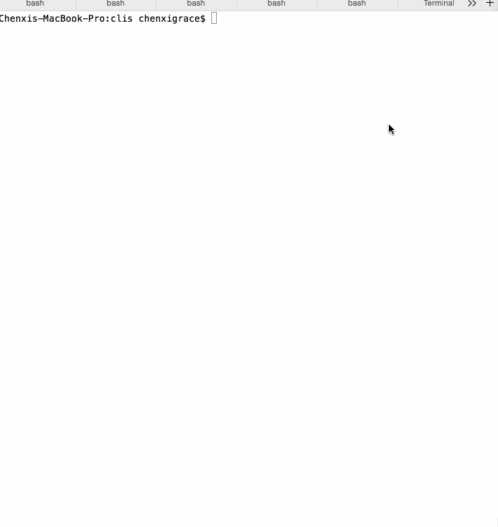

# CLI Utilities

This is a assignment of building a collection of common filesystem CLIs using nodejs to familiarize ourselves with node.js' runtime, module system and ascyhronous APIs.

Time spent: [5]

Completed:

* [x] Required: echo 
* [x] Required: cat
* [x] Required: touch
* [x] Required: ls
* [x] Optional: ls with a recursive option, -R
* [x] Required: mkdir
* [x] Optional: mkdir with recursive functionality
* [x] Required: rm 

Walkthrough Gif:
[Add walkthrough.gif to the project root]

